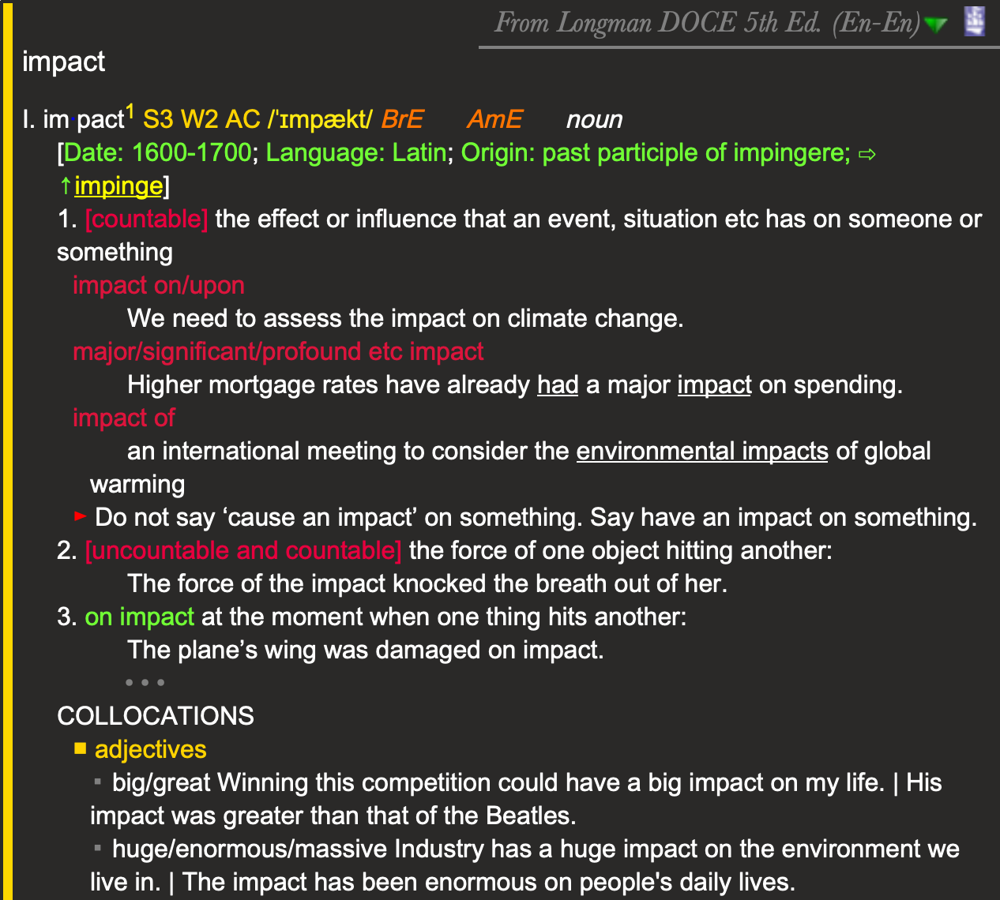

# Goldendict theme: Dark mode for MacOS

A dark mode of Goldendict. It if for MacOS as it use Tahmoma and Berksville fonts in MacOS. 

**You have to change the Line 193 in article-stype.css to the path to play.png in your local system.** 

